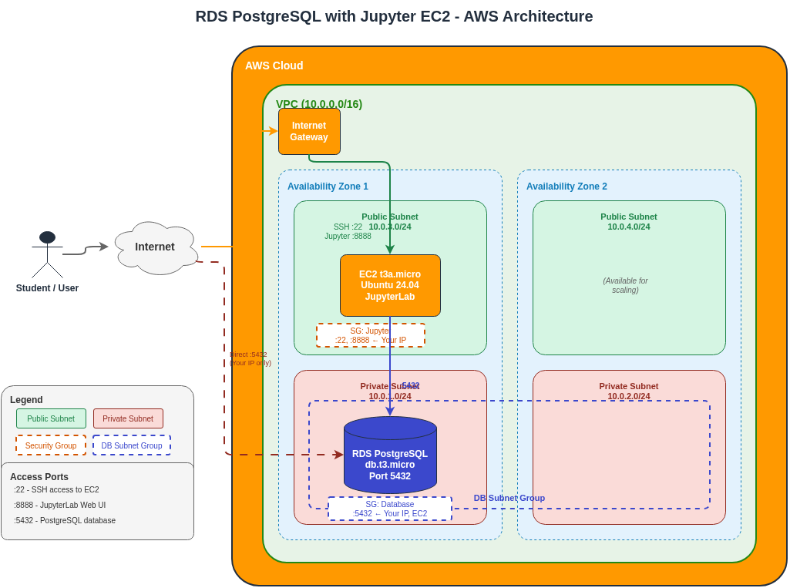

# RDS PostgreSQL CloudFormation Stack

This CloudFormation template deploys a PostgreSQL RDS instance with a pre-configured Jupyter EC2 instance for SQL practice.

## Architecture



### Architecture Overview

The stack creates a complete AWS environment for SQL learning:

1. **Network Layer**: A VPC with public and private subnets across 2 Availability Zones provides network isolation and high availability for the database.

2. **Compute Layer**: An EC2 instance (t3a.micro) running Ubuntu 24.04 with JupyterLab is deployed in a public subnet, accessible via SSH (port 22) and web browser (port 8888).

3. **Database Layer**: RDS PostgreSQL (db.t3.micro) runs in private subnets within a DB Subnet Group, accessible only from the EC2 instance and your IP address.

4. **Security**: Security groups restrict access:
   - **Jupyter SG**: Allows SSH and Jupyter access only from your IP
   - **Database SG**: Allows PostgreSQL connections from EC2 and your IP

### Data Flow

1. **Student/User** connects through the **Internet** to the **Internet Gateway**
2. Traffic routes to either:
   - **EC2 (JupyterLab)** on ports 22/8888 for notebook access
   - **RDS PostgreSQL** on port 5432 for direct database access (optional)
3. **EC2 → RDS**: The Jupyter instance connects to PostgreSQL on port 5432 within the VPC

## What Gets Created

- **VPC** with CIDR `10.0.0.0/16`
- **4 Subnets** across 2 Availability Zones (2 public, 2 private)
- **Internet Gateway** with routing for public subnets
- **Security Groups** for database, application, and Jupyter access
- **RDS PostgreSQL 15.15** instance (`db.t3.micro`, 20GB encrypted storage)
- **EC2 Jupyter Instance** (`t3a.micro`, Ubuntu 24.04) with:
  - Python 3.13 via [uv](https://docs.astral.sh/uv/)
  - JupyterLab pre-configured with RDS credentials
  - jupysql for SQL magic commands
  - jupyterlab-sql-explorer extension

## Project Structure

```
rds-pg/
├── cloudformation/
│   └── rds-postgresql.yaml      # CloudFormation template (VPC, RDS, EC2)
├── docs/
│   ├── architecture.drawio      # Architecture diagram (editable)
│   ├── architecture.png         # Architecture diagram (image)
│   └── permissions.md           # AWS IAM permissions guide
├── sql_practice.ipynb           # Basic SQL practice notebook
├── sql_advanced_practice.ipynb  # Advanced SQL: JOINs, CTEs, Triggers
├── connect.sh                   # Docker-based psql connection script
├── pyproject.toml               # Python dependencies (uv)
├── .python-version              # Python version (3.13)
├── LICENSE                      # CC BY-SA 4.0 license
└── README.md
```

## Prerequisites

- AWS CLI configured with appropriate credentials
- IAM permissions to create VPC, RDS, EC2, and IAM resources
- EC2 Key Pair for SSH access
- [uv](https://docs.astral.sh/uv/) (for local notebook development)
- Docker (optional, for `connect.sh`)

## Usage

### Create the Stack

```bash
# Get your current IP
MY_IP=$(curl -s ifconfig.me)

# Create stack with Jupyter EC2
aws cloudformation create-stack \
  --stack-name postgres-rds-stack \
  --template-body file://cloudformation/rds-postgresql.yaml \
  --parameters \
    ParameterKey=DBUsername,ParameterValue=postgres \
    ParameterKey=DBPassword,ParameterValue=YourSecurePassword123 \
    ParameterKey=MyIP,ParameterValue=$MY_IP \
    ParameterKey=KeyPairName,ParameterValue=your-keypair-name \
    ParameterKey=JupyterToken,ParameterValue=your-jupyter-token \
  --capabilities CAPABILITY_IAM \
  --region eu-west-1
```

### Wait for Stack Creation

```bash
aws cloudformation wait stack-create-complete \
  --stack-name postgres-rds-stack \
  --region eu-west-1
```

### Check Stack Status

```bash
aws cloudformation describe-stacks \
  --stack-name postgres-rds-stack \
  --query 'Stacks[0].StackStatus' \
  --output text \
  --region eu-west-1
```

### View Stack Events (Progress)

```bash
aws cloudformation describe-stack-events \
  --stack-name postgres-rds-stack \
  --query 'StackEvents[*].[Timestamp,ResourceStatus,ResourceType,LogicalResourceId]' \
  --output table \
  --region eu-west-1
```

### Get All Outputs

```bash
aws cloudformation describe-stacks \
  --stack-name postgres-rds-stack \
  --query 'Stacks[0].Outputs' \
  --output table \
  --region eu-west-1
```

### Destroy the Stack

```bash
aws cloudformation delete-stack \
  --stack-name postgres-rds-stack \
  --region eu-west-1
```

### Wait for Stack Deletion

```bash
aws cloudformation wait stack-delete-complete \
  --stack-name postgres-rds-stack \
  --region eu-west-1
```

## Accessing Jupyter on EC2

After stack creation, the Jupyter instance is ready to use:

### Get Access URLs

```bash
aws cloudformation describe-stacks \
  --stack-name postgres-rds-stack \
  --query 'Stacks[0].Outputs[?OutputKey==`JupyterURL`].OutputValue' \
  --output text \
  --region eu-west-1
```

### Open Jupyter

1. Navigate to `http://<JupyterPublicIP>:8888`
2. Enter your `JupyterToken` when prompted
3. The `.env` file is pre-configured with RDS credentials
4. Open `getting_started.ipynb` to begin

### SSH Access

```bash
ssh -i ~/.ssh/your-keypair.pem ubuntu@<JupyterPublicIP>
```

### Upload Your Notebooks

```bash
scp -i ~/.ssh/your-keypair.pem your_notebook.ipynb ubuntu@<JupyterPublicIP>:/tmp/
ssh -i ~/.ssh/your-keypair.pem ubuntu@<JupyterPublicIP> \
  "sudo cp /tmp/your_notebook.ipynb /home/jupyter/notebooks/ && sudo chown jupyter:jupyter /home/jupyter/notebooks/your_notebook.ipynb"
```

### Check Jupyter Service Status

```bash
ssh -i ~/.ssh/your-keypair.pem ubuntu@<JupyterPublicIP> "sudo systemctl status jupyter"
```

## Local Development

For running notebooks locally (instead of on EC2):

### Setup

Create a `.env` file with your RDS credentials:

```bash
# Get your IP
curl -s ifconfig.me

# Create .env (replace values)
cat > .env << EOF
DB_HOST=<DBEndpoint from stack outputs>
DB_PORT=5432
DB_USER=postgres
DB_PASSWORD=YourSecurePassword123
DB_NAME=mydb
EOF
```

### Run Jupyter Locally

```bash
uv sync
uv run jupyter lab sql_practice.ipynb
```

### Connect via psql (Docker)

```bash
./connect.sh
```

## SQL Practice Notebook

The `sql_practice.ipynb` notebook demonstrates SQL queries using jupysql magic commands.

Students can write SQL directly using `%%sql` magic:

```sql
%%sql
SELECT * FROM users WHERE city = 'Barcelona';
```

### SQL Explorer Setup

The JupyterLab SQL Explorer extension provides a visual database browser in the sidebar.

**On EC2 (automatic):** The SQL Explorer is pre-configured with RDS credentials at `/home/jupyter/work/.database/db_conf.json`. Just open the SQL Explorer panel in JupyterLab sidebar.

**Local development:** Create the config file from your `.env`:

```bash
mkdir -p ~/work/.database
cat > ~/work/.database/db_conf.json << EOF
{
    "rds": {
        "name": "rds",
        "db_type": "2",
        "db_id": "rds",
        "db_host": "$DB_HOST",
        "db_port": "$DB_PORT",
        "db_user": "$DB_USER",
        "db_pass": "$DB_PASSWORD",
        "db_name": "$DB_NAME"
    }
}
EOF
```

Or run this one-liner after sourcing `.env`:

```bash
source .env && mkdir -p ~/work/.database && echo "{\"rds\":{\"name\":\"rds\",\"db_type\":\"2\",\"db_id\":\"rds\",\"db_host\":\"$DB_HOST\",\"db_port\":\"$DB_PORT\",\"db_user\":\"$DB_USER\",\"db_pass\":\"$DB_PASSWORD\",\"db_name\":\"$DB_NAME\"}}" > ~/work/.database/db_conf.json
```

**Note:** `db_type` values: `1`=MySQL, `2`=PostgreSQL, `3`=Oracle, `6`=SQLite

## Configuration

| Parameter | Default | Description |
|-----------|---------|-------------|
| DBUsername | postgres | Master database username |
| DBPassword | (required) | Master password (min 8 characters) |
| MyIP | (required) | Your IP address for database and Jupyter access |
| KeyPairName | (required) | EC2 Key Pair name for SSH access |
| JupyterToken | jupyter-sql-practice | Token/password for Jupyter authentication |

## Infrastructure Specifications

### RDS Database

| Property | Value |
|----------|-------|
| Engine | PostgreSQL 15.15 |
| Instance Class | db.t3.micro |
| Storage | 20GB gp2 (encrypted) |
| Multi-AZ | No |
| Backup Retention | 7 days |
| Publicly Accessible | Yes |

### EC2 Jupyter Instance

| Property | Value |
|----------|-------|
| Instance Type | t3a.micro |
| OS | Ubuntu 24.04 LTS |
| Python | 3.13 (via uv) |
| Jupyter Port | 8888 |
| SSH Port | 22 |
| Access | Restricted to MyIP |

### Stack Outputs

| Output | Description |
|--------|-------------|
| DBEndpoint | RDS PostgreSQL hostname |
| DBPort | RDS port (5432) |
| JupyterPublicIP | EC2 public IP address |
| JupyterURL | Full Jupyter URL |
| SSHCommand | Ready-to-use SSH command |
| UploadNotebookCommand | SCP command for notebooks |
